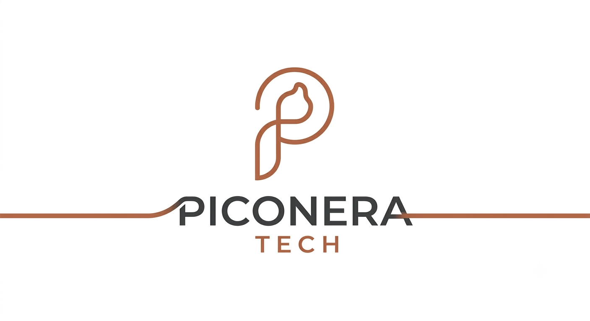

# Piconera Tech

<p align="center">
  
</p>

## Español

Landing de desarrollo de aplicaciones. Sitio estático listo para [GitHub Pages](https://pages.github.com/).

Vista local: abre `index.html` en el navegador o sirve la carpeta:

```powershell
npx --yes serve .
```

### Publicar

1. Crea el repositorio `piconeratech` en GitHub (cuenta `martamacfly`).
2. Sube este directorio a `main`.
3. En el repo: **Settings → Pages → Deploy from a branch → `main` / root**.
4. La URL quedará en `https://martamacfly.github.io/piconeratech/`.

Si prefieres el dominio de usuario (`https://martamacfly.github.io/`), copia el contenido a ese repositorio en lugar de usar un proyecto.

### Qué incluye esta base

- Identidad a partir del logo de cobre y de los moodboards andaluces.
- Porfolio extraído de los proyectos en `developeh`: YouList, Bienestoy, Checkeasy, Comi2, Mestruendo, MoyBi, Rocketa, Shame y Slash Highlight.
- Filtros de proyectos, menú móvil, página 404 e interruptor de idioma español/inglés.

Los moodboards de referencia están en `assets/brand-refs/` y no se muestran en la web.

## English

Application development landing page. Static site ready for [GitHub Pages](https://pages.github.com/).

Local preview: open `index.html` in the browser, or serve the folder:

```powershell
npx --yes serve .
```

### Publish

1. Create the `piconeratech` repository on GitHub (account `martamacfly`).
2. Push this directory to `main`.
3. In the repo: **Settings → Pages → Deploy from a branch → `main` / root**.
4. The URL will be `https://martamacfly.github.io/piconeratech/`.

If you prefer the user site (`https://martamacfly.github.io/`), copy the contents into that repository instead of using a project site.

### What this base includes

- Identity based on the copper logo and the Andalusian moodboards.
- Portfolio drawn from the projects in `developeh`: YouList, Bienestoy, Checkeasy, Comi2, Mestruendo, MoyBi, Rocketa, Shame, and Slash Highlight.
- Project filters, mobile menu, 404 page, and a Spanish/English language switch.

Reference moodboards live in `assets/brand-refs/` and are not shown on the site.
